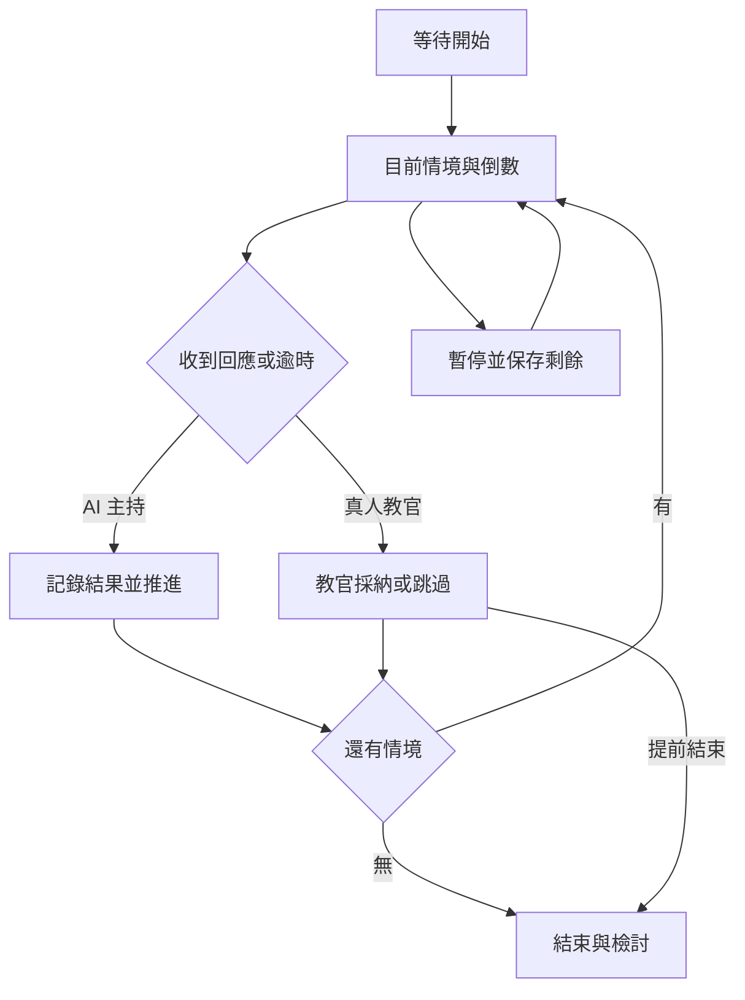

# FireCommand v27 完整優化規劃

日期：2026-09-07。依據：使用者本次完整需求、兩張 v26 操作截圖、可編輯的 v26 程式，以及下列官方來源。

本文件分清三種內容：**使用者需求、v27 已實作、後續深化設計**。後續設計不視為已完成的功能。

## 一、整體架構與資料邊界

系統共用同一套案件事實、角色回報、部署圖與報告能力，分成實戰、引導練習及自主測驗三種操作情境。實戰資料不由演練角色修改；演練資料持續標示為模擬。

| 模組 | 在整體系統的位置 | v27 的處理 |
|---|---|---|
| 案件事實 | 所有判斷的共同基礎 | 開案填入初始資料，後續由 SOP、戰情及部署更新 |
| 角色與權限 | 決定誰可以主持、操作、觀察 | 分離房主、真人教官與受測角色；房主可啟動 AI 主持 |
| 情境引擎 | 決定目前正在練哪一個問題 | 有限的分階段情境、反應時限、回應／逾時推進、結束 |
| 協作情報 | 把各人的操作與回報串在一起 | 一欄顯示教官情境，另一欄顯示真人及 AI 回報 |
| 圖形部署 | 把人車水線轉為可共享的空間資訊 | 文字解析、預覽核對、批次套用與旋轉保持連接 |
| 知識參考 | 為指揮提醒提供可查證的依據 | 官方化災入口、SDS 文件擷取、版本保存與 AI 上下文 |
| 檢討評估 | 回看決策與時效，支持下次練習 | 情境時間軸、暫停與時效統計，保留人工及 AI 檢討 |
| 操作介面 | 把上述資訊以少量動作交給操作者 | 概要置中、五格導覽、漸進展開與裝置分欄 |

**概要繼續維持唯讀。** 它的定位是共同事實的彙整畫面；不另開第二個可自由修改的資料來源。這延續前一輪已確認的操作原則。

## 二、開房流程：先確認教官，再配置角色

### 開房選項

| 問題 | 選擇 | 形成的模式 |
|---|---|---|
| 你要擔任教官出題嗎？ | 否 | AI 教官主持；房主選自己的受測角色 |
| 同上 | 是 | 房主為真人教官；由其他真人加入受測角色 |
| 需要提示嗎？ | 引導練習 | 顯示角色焦點及處置範本 |
| 同上 | 自主測驗 | 隱藏提示，保留原始情報与回應輸入 |
| 情境來源？ | 個人設定／AI／案例檔案 | 沿用 v26 的建立方式 |

開房者不再因為「房主」而自動看到教官出題按鈕。選擇單人練習時仍保有開始及暫停權，但沒有真人教官的手動出題與跳關控制。

真人接手某個角色後，同角色 AI 不再發話。初期指揮官與現場指揮官視為同一指揮席位，避免一邊由使用者指揮，一邊又加入另一個 AI 指揮官。

### 各角色應看的重點

| 角色 | 主要問題 | v27 專屬焦點與輸入範本 | 共用頁面 |
|---|---|---|---|
| 現場指揮官 | 誰在何處做什麼？何時回報？ | 單位、位置、任務、時限與回報要求 | 概要、SOP、部署 |
| 初期指揮官 | 到場已知什麼？指揮如何建立與移交？ | 建物／火煙／人命、第一面、指揮點、支援 | SOP、戰情 |
| 安全官 | 哪個風險正在影響哪些人？ | 危害位置、受影響單位、措施與安全條件 | 戰情、部署、化災資料 |
| 紀錄官 | 何時收到什麼？與既有資訊是否衝突？ | 時間、單位、情報、比對結果、待追蹤項目 | 戰情、報告 |
| 分區指揮官 | 分區資源是否足夠？進度與障礙是什麼？ | 分區、人車水線、任務、進度、資源需求 | 部署、戰情 |
| 單位帶隊官 | 小組在哪裡？人員狀態如何？ | 單位、人數、位置、任務、障礙與人員狀態 | 戰情、人車 |
| 教官 | 是否達到本階段教學目的？ | 建議情境、手動輸入、時間設定與採納回應 | 教官控制、檢討 |
| 觀察員 | 整體決策如何發展？ | 閱讀角色與時序 | 概要、情報、回放 |

v27 先完成角色焦點、回應入口及控制權限分離；原有完整案件工具仍共用。不同角色完全獨立的任務清單／專屬儀表板，是後續深化項目。

## 三、情境的連續感：一條主情境，加上協作訊息

**情境引擎**是保存訓練進度並依事件切換階段的程式。白話說，它負責記住「目前考哪一題、還剩多少時間、收到哪些回應、接下來怎麼走」。例如第一到場回報後進入人命資訊變更，再進入供水問題。

v27 的流程如下：

### 時間規則

- 情境時間是訓練設定，不是官方必須在幾秒內完成的現場 SOP 標準。
- v27 可設定 30–900 秒；預設腳本依階段使用 180、180、120、300、30 秒。
- 30 秒可用於需要迅速表達判斷的題目；3–5 分鐘可用於較完整的部署或回報練習。這是產品設計建議，仍應由帶訓教官校準。
- 暫停保存剩餘時間，不重新給一個完整時限；暫停另列次數與時長。
- 背景或鎖屏不等於暫停。房主回到頁面後，系統先處理當前階段，避免一次連跳所有未處理情境。
- 多人 AI 房中，以房主的主受測角色回應推進；協作者發言只進情報欄。避免幕僚一句回應讓指揮官還沒判斷就跳題。

### 雙欄訊息

| 欄位 | 放什麼 | 不混入什麼 |
|---|---|---|
| 模擬情境狀況 | 當前題目、來源、剩餘時間、我的處置 | 尚未發布的情境與參與者名單 |
| 協作情報與回報 | AI 回應、真人回報、SOP／部署等操作紀錄 | 假裝已完成的任務與沒有來源的現場事實 |

真人教官可使用「水源變化、情報落差、煙流變化」建議，也可改文字與時間再加入佇列。v27 是尾端追加；立即插入、分支選擇與事件相依性編輯器列為後續深化。

## 四、遊戲化的方向與界線

參考 XVR On Scene 將決策、動態情境與教官控制結合的訓練思路：參與者觀察、判讀、決策，教官依教學目標調整過程。這是其官方功能說明；本系統採用的是訓練設計原則，沒有複製其專有軟體。[XVR On Scene 官方說明](https://learnprogroup.com/xvr/solutions/xvr-on-scene/)

我建議的遊戲化重點：

| 設計原則 | 原因 | v27 與後續 |
|---|---|---|
| 以決策後果形成連續感 | 比一直跳警示更接近指揮訓練 | v27 回應／逾時推進；後續加入條件分支 |
| 角色資訊不完全相同 | 練習詢問、比對與回報閉環 | v27 分角色回應；後續加入角色限定情報 |
| 讓新手能帶訓 | 有意願但經驗少的協助者也能選題 | v27 建議按鈕與可修改情境 |
| 完成任務與作答分開 | 點選不等於實際部署或安全控制完成 | v27 不以按鍵判定戰術正確 |
| 回放可定位問題 | 知道在哪一階段猶豫、漏問或未回報 | v27 時間軸及回應內容；後續加入事件重播 |
| 難度可調 | 基礎練順序，進階練衝突與壓力 | v27 難度及提示模式；後續加權任務複雜度 |

### 下一階段的目標判定設計（尚未實作）

每個情境應增加：教學目標、必要資訊、可接受行動、關鍵失誤、佐證事件、分支條件及結束條件。自動判定應分三層：

1. **可直接驗證**：是否建立指揮紀錄、是否送出 PAR 要求、是否指定水線來源與終點。
2. **需要語意判讀**：是否說明風險、是否提出合理的任務與回報條件；由 AI 產生帶證據的評語。
3. **需教官裁量**：攻防決策與例外情境是否合理；保留覆核與修正權。

這比讓 AI 一句話決定「合格」更可追溯。v27 的自動結束是完成有限腳本，不宣稱已自動驗證所有教學目的。

## 五、介面與人體操作

### 概要置中

採用「流程｜戰情｜概要｜部署｜更多」。中央概要小幅凸出 6px，以色彩與高度提示它是共同掌握情況的入口。AI、人車、報告及檢討放在更多功能。

如此可讓手機第一層保持五個固定按鈕，不必水平滑動才能找功能。概要按鈕不做過大的立體裝飾，避免搶走部署與戰情的點擊空間。

### 裝置適應

| 裝置 | 主要配置 | 操作考量 |
|---|---|---|
| 手機直式 | 當前情境在前、協作情報在後；底部五格導覽 | 用單欄維持可讀性，名單與歷史收合 |
| 手機橫式 | 足夠寬度時左右顯示兩類情報 | 降低上方高度，保留回應區 |
| 桌面 | 左側導覽、完整寬度練習區、下方案件內容 | 明確指定格線位置，修正 v26 誤排至窄欄 |
| 字體放大 | 表單與按鈕保留彈性高度 | 防止標題和文字互相覆蓋 |

頁首採深藍、內容採白底，紅色主要代表練習與警示。表單常用字體以 16px 為基礎，常用標籤約 14px，按鈕至少 44px 高；支援焦點框及減少動畫偏好。這些是實作尺寸，尚須在實際裝置驗收手感。

## 六、文字／語音轉部署圖

**拓撲**指物件之間的連接關係，而非畫面座標。例如淡水61供水給淡水11，再由淡水11出線到第一面；即使建物轉向，這兩段連接仍應保持。

v27 使用穩定的車輛與面向識別碼儲存水線端點，將連接對象與圖上位置分開。

| 輸入 | 解析結果 | 使用者確認 |
|---|---|---|
| 淡水61供水給淡水11 | 車→車的供水連結 | 起終點與任務 |
| 淡水11第一面出兩線 | 車→第一面，共兩線 | 面向與條數 |
| 竹圍4人第三面搜救 | 一個4人編組與面向／任務 | 人數與任務狀態 |
| 消防栓位置未指定 | 不補造座標 | 保留文字，手動補充 |
| 三樓內部路徑 | 目前外部連結模型不能完整表達 | 使用原建物作戰圖補畫 |

處理順序是「描述→結構化擷取→可修改預覽→確認套用→人工微調」。AI 失敗時使用本機規則解析，不能解析的句子保留待確認。

新增草圖採相對建物位置，旋轉時一起轉；既有實地座標及人工拖曳確認位置保持固定。若後續要支援整個樓層、進出入口、分歧器與消防栓，應擴充節點類型，而不是在文字中暗示已完成連線。

## 七、SDS 與可追溯知識

**安全資料表（Safety Data Sheet, SDS）**是記錄化學品識別、危害與安全處置等資訊的文件，通常以 16 項結構呈現。白話說，它是產品的危害與應變說明；例如查某一廠商的混合溶劑時，要比對產品名稱、成分與濃度，不能只查到其中一個純物質就直接套用。[OSHA SDS 結構](https://www.osha.gov/hazcom/appendix-d)

### 來源層級

| 來源 | 適用方式 | 邊界 |
|---|---|---|
| 現場製造商／供應商產品 SDS | 優先核對產品、濃度及修訂版 | 必須確認與現場產品一致 |
| 職安署危害資料 | 查一般物質危害與交叉核對 | 官方明示不能直接取代事業單位 SDS |
| 環境部毒化物查詢 | 查毒性及關注化學物質資料 | 仍需與實際物質識別相符 |
| PHMSA ERG | 危險物品運輸事故初期辨識與指引 | 不當作所有場所、所有處置階段的完整手冊 |
| AI 摘錄與建議 | 加速閱讀及整理已核對資料 | 不是原文來源，未知不可補造 |

職安署亦提醒，混合物形式、運作量及濃度差異可能影響危害、防護與滅火資訊。[職安署使用聲明](https://ghs.osha.gov.tw/cht/intro/search.aspx)

PHMSA 將 ERG 2024 定位為危險物品運輸事故初期供第一線應變者使用的指引。[PHMSA ERG](https://www.phmsa.dot.gov/training/hazmat/erg/emergency-response-guidebook-erg)

### v27 已完成的文件流程

上傳原檔或填原文連結 → AI 擷取或人工填寫 → 查看 16 項 → 人工核對 → 保存來源、版本與核對紀錄 → 提供案件查閱與 AI 參考。

優先顯示第2、4、5、6、8、10、14項；其餘仍可展開。原文不足時維持「原文未提供」。原檔保留 SHA-256、原始名稱，讓後續知道當時參考的是哪份文件。

### 後續知識庫深化（尚未實作）

- 將轄區工廠、運作場所、產品與 SDS 建立經核准的對應。
- 增加版本到期檢查、修訂通知與舊版保存。
- 將地方 SOP、案例及危害文件建立章節級索引，回答附可回到原文的段落位置。
- 提供離線快取與同步狀態，斷網時只能顯示已保存內容及其日期。
- 若要自動檢索網站或供應商 SDS，需先確認資料使用條件、API及維護責任。v27 未宣稱已完成全網即時檢索。

## 八、版本深化順序

| 階段 | 建議優先項目 | 完成判準 |
|---|---|---|
| 本次 v27 | 有限連續情境、角色分權、雙情報、快輸入與 SDS 來源 | 已編寫程式，16 項程式測試通過；正式驗收待執行 |
| 下一輪 P0 | 正式兩帳號、手機與權限驗收 | 依驗收表逐項記錄，修正實際問題 |
| 下一輪 P1 | 伺服器主持、房主離線接棒、角色獨占 | 任一端斷線不破壞場次時序 |
| 下一輪 P1 | 目標與分支、危急事件、佐證式評語 | 每項評語可追溯到具體回應或操作 |
| 下一輪 P2 | 消防栓／分歧器／樓層路徑轉圖 | 未解析項目清楚列出，連接與撤回一致 |
| 下一輪 P2 | 經核准知識庫、SDS 更新與離線 | 每個來源有版本、審核、適用條件與維護人 |

這份規劃可持續追加新案例與 SOP，新增內容應回到同一套角色、事件、部署與證據結構，不另外形成互不相連的功能頁。
